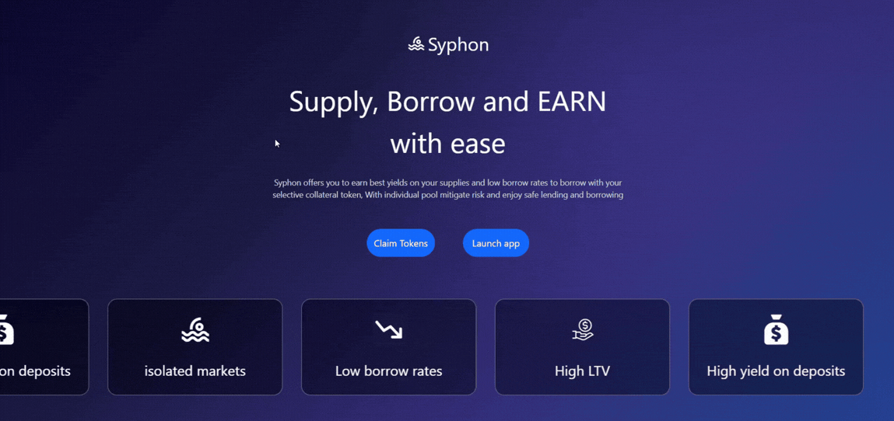

# 🌊 Syphon Liquidity — Supply, Borrow and EARN with Ease

> If you are from Twitter or LinkedIn, please leave a like 💝

working walkthrough of the dapp - 

---

## What is Syphon?

Syphon is a lending and borrowing protocol where users can supply collateral and borrow against the supplied collateral. Users can become liquidity providers by providing liquidity to markets of their choice.

Syphon offers you the best yields on your supplies and low borrow rates to borrow with your selective collateral token. With individual pools, mitigate risk and enjoy safe lending and borrowing.

> **Note:** This protocol is not a clone of Morpho or Aave. It is a standalone protocol that calls its own set of smart contracts built from scratch.

---

## ✨ Features

| Feature | Description |
|---|---|
| 🏦 **Supply & Borrow** | Supply collateral tokens and borrow loans against them with high LTV |
| 💧 **Liquidity Providers** | Provide liquidity to your desired market and earn stress-free yield |
| ⚡ **Liquidate Positions** | Liquidate positions and get collateral with bonus and benefits |
| 📊 **Featured Dashboard** | Monitor all of your positions in one place for easy access |

---

## 🧱 Core Principles

### 🔒 Isolated Markets

Syphon focuses on risk mitigation using isolated pools where token pairs have their own separate pools rather than being in a single unified pool — the same mechanism used by Morpho and Aave v4 (newer version of Aave).

### 📈 Adjusted Borrow Rates

The protocol uses an interest rate model to adjust its borrow interest rates. The particular model used is the **Adaptive Curve Interest Rate Model**, where interest is adjusted based on the utilization rate — linear up to a certain utilization rate, then sharply spikes.

### 🎯 High LTV

The protocol uses **LLTV (Liquidation Loan-to-Value)** instead of plain LTV, which gives users more flexibility to choose their borrow amount. To safeguard users, a **Safe LTV** is also provided as the recommended threshold to avoid being liquidated.

### 💰 High Yield

Liquidity providers get high yield as a huge portion of the borrow interest goes directly to them. This attracts more liquidity providers, making markets more stable and secure from acquiring bad debt.

### 🔮 Oracle for Pricing

Syphon heavily depends on oracle price feeds to get the price of tokens for a smooth operating system — where liquidation LTV, borrowing rates, and LTV are safely calculated with no room for error.

---

## 🔬 Mathematical Models & Algorithms

1. **Adaptive Curve Interest Rate Model** — Core interest rate model
2. **Utilization-Based Dynamic Pricing** — Continuously adjusts rates based on utilization
3. **Adaptive Feedback Control System** — IRM implemented as a control-theory feedback loop
4. **Piecewise Interest Rate Curve** — Uses a nonlinear curve above and below the target utilization
5. **Continuous Compounding Interest Accrual** — Borrow APY calculated using exponential compounding
6. **Oracle-Based Risk Engine** — Relies heavily on oracle math for collateral valuation and liquidations

---

The protocol is still in testing and will be deployed on base soon!

---

Built with ❤️ by Amogh Patil

